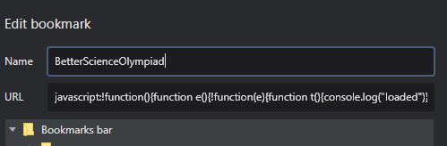

# SciOly Extension (as a bookmark)


Try dragging the below link to your bookmarks bar. If that worked, then you don't need to do anything else! Just click the bookmark every time you want to load the extension.

<a href="javascript:!function(){function e(){!function(e){function t(){console.log('loaded')}let n=document.createElement('script');n.src='https://nepaltechguy2.github.io/scioly-chrome/bookmarklet.js?_='+Date.now(),n.addEventListener?n.addEventListener('load',t,!1):n.readyState&&(n.onreadystatechange=t),document.body.appendChild(n)}(jQuery.noConflict(!0))}let t=document.createElement('script');t.src='https://nepaltechguy2.github.io/scioly-chrome/vendor/jquery-3.4.1.min.js',t.addEventListener?t.addEventListener('load',e,!1):t.readyState&&(t.onreadystatechange=e),document.body.appendChild(t)}();"> SciOly.org Extension </a>


If that didn't work, then follow the instructions below: 

## Manual Installation

Here's how you can add the better scioly.org forums extension as a chrome extension!

1. Copy the code below to your clipboard: 

Single line: 
```
javascript:!function(){function e(){!function(e){function t(){console.log("loaded")}let n=document.createElement("script");n.src="https://nepaltechguy2.github.io/scioly-chrome/bookmarklet.js?_="+Date.now(),n.addEventListener?n.addEventListener("load",t,!1):n.readyState&&(n.onreadystatechange=t),document.body.appendChild(n)}(jQuery.noConflict(!0))}let t=document.createElement("script");t.src="https://nepaltechguy2.github.io/scioly-chrome/vendor/jquery-3.4.1.min.js",t.addEventListener?t.addEventListener("load",e,!1):t.readyState&&(t.onreadystatechange=e),document.body.appendChild(t)}();
```
Expanded:
```javascript
javascript:(function () {
    function callback() {
        (function ($) {
            let jQuery = $;

            function callback() {
                console.log("loaded")
            }

            let s = document.createElement("script");
            s.src = "https://nepaltechguy2.github.io/scioly-chrome/bookmarklet.js?_="+Date.now();
            if (s.addEventListener) {
                s.addEventListener("load", callback, false)
            } else if (s.readyState) {
                s.onreadystatechange = callback
            }
            document.body.appendChild(s);
        })(jQuery.noConflict(true))
    }

    let s = document.createElement("script");
    s.src = "https://nepaltechguy2.github.io/scioly-chrome/vendor/jquery-3.4.1.min.js";
    if (s.addEventListener) {
        s.addEventListener("load", callback, false)
    } else if (s.readyState) {
        s.onreadystatechange = callback
    }
    document.body.appendChild(s);
})();
```

You then need to create the bookmark itself: Right click on the bookmarks bar and click "Add Page". Set the title to whatever you want ("Better Forums"), and set the page URL to the code you copied above. 

It should look like this: 



That's it! Now on every page you want to load the forums extension, just click on the bookmarklet. All the features will be pulled across and will automatically update. :)
